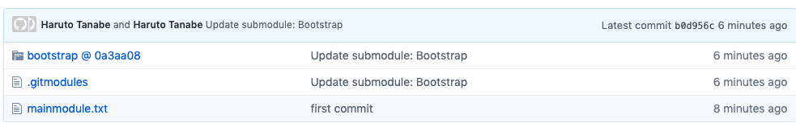

#### 　サブモジュールの作り方

メインモジュールを作成する

メインモジュールの中に以下のコマンドを叩くとサブモジュールとして連携できる

例）メインモジュールにBootstarpのモジュールを入れる

```shell
git submodule add https://github.com/twbs/bootstrap.git bootstrap
git add bootstrap
git commit -m "Add Twitter Bootstrap as a submodule"
```

↓　プッシュすると以下のようにコミットIDが付与された形で管理できる



！Dockerを管理するとき、アプリケーションのソースコードとインフラの構築コードで分離することができるので便利